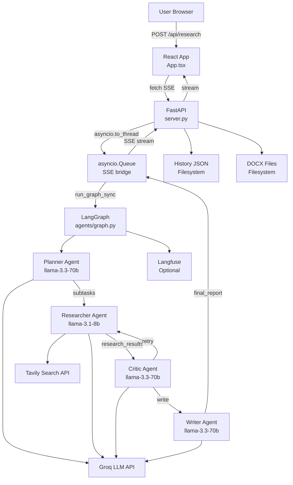

# Atlas AI Research Agent — Deep Technical Analysis

> **Scope:** Complete codebase review for understanding, debugging, modification, and interview preparation  
> **Rule:** `[Inference]` = not directly in code. `[Recommendation]` = suggested improvement.

---

## Table of Contents
1. [Project Overview](#1-project-overview)
2. [Architecture](#2-architecture)
3. [Complete Execution Flow](#3-complete-execution-flow)
4. [Codebase Structure](#4-codebase-structure)
5. [Data Flow](#5-data-flow)
6. [Technical Problems & Solutions](#6-technical-problems--solutions)
7. [Technology Stack](#7-technology-stack)
8. [APIs & Integrations](#8-apis--integrations)
9. [Error Handling & Security](#9-error-handling--security)
10. [Performance & Scalability](#10-performance--scalability)
11. [Testing & Deployment](#11-testing--deployment)
12. [Code Review](#12-code-review)
13. [Interview Preparation](#13-interview-preparation)
14. [Learning Path](#14-learning-path)
15. [Final Mental Model](#15-final-mental-model)

---

## 1. Project Overview

### What the project does

**Atlas** is a multi-agent AI research system. A user enters a topic; four specialized AI agents collaborate to decompose it into subtasks, search the web, evaluate quality, and produce a professional research report — downloadable as `.docx`.

### Problem it solves

Manual research on a complex topic requires hours of searching, reading, synthesizing, and writing. Atlas automates this end-to-end using a coordinated agent pipeline that mirrors how a real consulting team divides the work.

### Target users / use case
- Students, researchers, and analysts who need credible overviews fast
- Developers and PMs doing technology landscape or competitive research
- Anyone who wants a citable, well-structured report in under a minute

### Main features

| Feature | Implementation |
|---|---|
| 4-agent research pipeline | `agents/graph.py` — LangGraph StateGraph |
| Live streaming UI | `server.py` SSE + `App.tsx` SSE reader |
| Critic retry loop | conditional edge in `graph.py`, logic in `critic.py` |
| Cost & token budgeting | `config.py` constants enforced in `critic.py` |
| Per-run observability | `utils/tracing.py` TracingContext + Langfuse (optional) |
| Professional `.docx` export | `utils/doc_generator.py` — python-docx |
| Mermaid diagram rendering | writer generates code; `MarkdownRenderer.tsx` renders SVG |
| Research history | `server.py` JSON files + `HistorySidebar.tsx` UI |
| Benchmark / evaluation | `tests/test_topics.py`, `utils/eval.py` |

---

## 2. Architecture

### Two UIs, one shared pipeline

The project has **two parallel frontends** and **one shared backend pipeline**:

1. **React + Vite frontend** — primary UI, served statically by FastAPI. Uses SSE streaming.
2. **Streamlit app** (`app.py`) — standalone alternative UI for quick local testing.
3. **FastAPI backend** (`server.py`) — SSE API, history CRUD, static file serving.
4. **LangGraph pipeline** (`agents/`) — the core AI engine: 4 Python functions as a directed graph.
5. **Utility layer** (`utils/`) — LLM factory, tracing, doc generator, evaluation.

### ASCII Component Map

```
Browser (React)
  App.tsx           → SSE reader, UI state machine
  MarkdownRenderer  → react-markdown + mermaid.js SVG
  HistorySidebar    → history list, search, delete
        │
        │ HTTP POST /api/research (SSE)
        │ HTTP GET  /api/history
        │ HTTP GET  /api/download/:filename
        ▼
FastAPI (server.py)
  /api/research → asyncio.to_thread(run_graph_sync)
  /api/history  → reads/writes JSON files
  /api/download → serves .docx
  /*            → serves React SPA
        │
        │ asyncio.Queue (thread→async bridge)
        ▼
LangGraph Pipeline (agents/)
  planner_agent → researcher_agent → critic_agent ─(retry)─┐
                                           │                 │
                                        (write)              └──────┘
                                           │
                                      writer_agent → END
        │
   ┌────┴─────────┬──────────────┐
   Groq API   Tavily API   Langfuse (optional)
```

### Mermaid Architecture Diagram



---

## 3. Complete Execution Flow

```
User types topic → clicks "Dispatch the team"
     │
     ▼
[App.tsx:run()]
  POST /api/research {topic: "..."}
     │
     ▼
[server.py:/api/research]
  - Validate topic non-empty
  - asyncio.Queue created
  - asyncio.to_thread(run_graph_sync, topic, queue) — background thread
  - StreamingResponse(event_generator(), media_type="text/event-stream")
     │
     ▼
[server.py:run_graph_sync()]  ← runs in thread
  1. build_graph()          → StateGraph compiled
  2. generate_report_id()   → 12-char hex UUID
  3. create_tracing_context()→ TracingContext + Langfuse trace opened
  4. initial_state dict built (topic, empty fields, zero metrics)
  5. graph.stream(initial_state, stream_mode="values")
       │
       ├─ Node 1: planner_agent(state)
       │    - get_llm(role="planner") → ChatGroq(llama-3.3-70b-versatile)
       │    - ctx.start_span("planner")
       │    - llm.invoke([SystemMessage, HumanMessage(topic)])
       │    - JSON parse → subtasks list [4-5 items]
       │    - ctx.record_llm_call() → tokens + cost accumulated
       │    - returns {subtasks, current_agent:"planner", log:[...]}
       │    - queue.put_nowait(sse_event)  ← React gets "planner active"
       │
       ├─ Node 2: research_agent(state)
       │    - get_llm(role="researcher") → ChatGroq(llama-3.1-8b-instant)  ← CHEAPER
       │    - tavily = TavilyClient(TAVILY_API_KEY)
       │    - FOR EACH subtask (sequential):
       │        • tavily.search(query=subtask, search_depth="advanced", max_results=5)
       │        • Build context from results: title + url + content[:500]
       │        • llm.invoke([SystemMsg, HumanMsg(subtask + context)])
       │        • research_results.append({subtask, synthesis, sources})
       │    - returns {research_results, sources, current_agent:"researcher", log:[...]}
       │    - queue.put_nowait(sse_event)
       │
       ├─ Node 3: critic_agent(state)
       │    - get_llm(role="critic") → ChatGroq(llama-3.3-70b-versatile)
       │    - Build research_summary (400 chars per subtask)
       │    - llm.invoke() → JSON {needs_more_research, critique, quality_score}
       │    - GUARDRAIL CHECKS:
       │        • retry_count >= MAX_RETRIES(2)?       → force needs_more=False
       │        • total_tokens >= MAX_TOKENS(100,000)? → force needs_more=False
       │        • total_cost >= MAX_COST($0.10)?       → force needs_more=False
       │    - returns {needs_more_research, critique, retry_count+1, ...}
       │    - queue.put_nowait(sse_event)
       │
       ├─ [Conditional edge: should_retry(state)]
       │    - needs_more_research AND retry_count < MAX_RETRIES?
       │        YES → back to research_agent (retry loop)
       │        NO  → forward to writer_agent
       │
       └─ Node 4: writer_agent(state)
            - get_llm(role="writer") → ChatGroq(llama-3.3-70b-versatile)
            - research_content = "## subtask\nsynthesis\n\n" × n
            - Include critic_note and guardrail_note if applicable
            - llm.invoke() → full markdown (800-1000 words + optional mermaid)
            - fix_mermaid_syntax(response.content) → regex post-processing
            - returns {final_report, current_agent:"writer", log:[...]}

  6. After graph completes:
     - generate_docx(topic, final_report, sources) → bytes
     - Write REPORTS_DIR/report_<uuid>.docx
     - Write HISTORY_DIR/<session_id>.json
     - ctx.finalize() → Langfuse trace closed + flushed
     - queue.put_nowait({"type":"complete", "report":..., "docx_filename":..., "metrics":...})
     - queue.put_nowait(None)  ← sentinel: stream done
     │
     ▼
[App.tsx:handleSSEEvent()]
  - Parse "data: {json}\n\n" lines
  - Update agent statuses → AgentCard re-renders (idle/active/done)
  - Update subtasks → research threads section fills in
  - On type=="complete":
      - setReport(markdown) → MarkdownRenderer renders
      - Mermaid blocks → MermaidBlock → mermaid.render() → inline SVG
      - localStorage.setItem(atlas_current_session, ...)
```

---

## 4. Codebase Structure

```
AI-Research-Agent/
│
├── app.py           ← Streamlit UI (standalone alternative)
├── server.py        ← FastAPI backend + SSE + history + static serving
├── config.py        ← ALL tunable constants (models, costs, limits)
├── requirements.txt ← Python deps (pinned)
├── Dockerfile       ← Multi-stage: Node build → Python runtime
├── vercel.json      ← Vercel deployment config
├── .env.example     ← API key template
│
├── agents/
│   ├── state.py     ← ResearchState TypedDict (shared data contract)
│   ├── graph.py     ← LangGraph StateGraph topology
│   ├── planner.py   ← Agent 1: topic → subtasks
│   ├── researcher.py← Agent 2: subtasks → web search + synthesis
│   ├── critic.py    ← Agent 3: evaluate + guardrails + retry decision
│   └── writer.py    ← Agent 4: research → final markdown report
│
├── utils/
│   ├── llm.py       ← ChatGroq factory with multi-key fallback
│   ├── tracing.py   ← TracingContext, Langfuse spans, cost accumulation
│   ├── doc_generator.py ← python-docx builder + mermaid.ink PNG
│   └── eval.py      ← Citation coverage + LLM completeness judge
│
├── frontend/
│   └── src/
│       ├── App.tsx           ← SSE client + UI state machine
│       ├── MarkdownRenderer.tsx ← react-markdown + mermaid.js
│       ├── HistorySidebar.tsx   ← slide-in history panel
│       └── index.css
│
├── tests/
│   └── test_topics.py ← integration benchmark harness
│
├── history/         ← auto-created; session JSON files
└── generated_reports/ ← auto-created; .docx report files
```

### Entry Points

| Entry | Command | Purpose |
|---|---|---|
| `server.py` | `python server.py` | Full-stack: React + API |
| `app.py` | `streamlit run app.py` | Streamlit-only UI |
| `tests/test_topics.py` | `python tests/test_topics.py` | Benchmark runner |

### Key Classes & Functions

| Symbol | File | Role |
|---|---|---|
| `ResearchState` | `agents/state.py` | TypedDict: shared state between all agents |
| `build_graph()` | `agents/graph.py` | Assembles + compiles the LangGraph StateGraph |
| `planner_agent()` | `agents/planner.py` | Node 1: topic → subtasks JSON |
| `research_agent()` | `agents/researcher.py` | Node 2: subtasks → web search + synthesis |
| `critic_agent()` | `agents/critic.py` | Node 3: quality score + guardrail enforcement |
| `should_retry()` | `agents/critic.py` | Conditional edge: "retry" or "write" |
| `writer_agent()` | `agents/writer.py` | Node 4: research → markdown report |
| `fix_mermaid_syntax()` | `agents/writer.py` | Regex fixer for LLM mermaid hallucinations |
| `get_llm()` | `utils/llm.py` | Factory: role → ChatGroq + multi-key fallback |
| `TracingContext` | `utils/tracing.py` | Per-run token/cost tracking + Langfuse spans |
| `generate_docx()` | `utils/doc_generator.py` | Markdown → styled .docx with mermaid PNG |
| `run_graph_sync()` | `server.py` | Thread wrapper that drives graph + emits SSE events |
| `handleSSEEvent()` | `frontend/src/App.tsx` | Frontend SSE parser → UI state transitions |
| `MermaidBlock` | `frontend/src/MarkdownRenderer.tsx` | mermaid string → inline SVG via mermaid.js |

---

## 5. Data Flow

### Phase 1 — Input → Planning
```
User topic (string)
  → ResearchState.topic
  → planner_agent: llm.invoke([SystemMsg, HumanMsg(topic)])
  → LLM: JSON array of 4–5 strings
  → ResearchState.subtasks = ["subtask1", "subtask2", ...]
```

### Phase 2 — Research (sequential per subtask)
```
For each subtask in ResearchState.subtasks:
  → TavilyClient.search(query=subtask, max_results=5)
  → raw results [{title, url, content[:500]}, ...]
  → context string assembled
  → llm.invoke([SystemMsg, HumanMsg(subtask + context)])
  → synthesis ~200-400 words
  → research_results.append({subtask, synthesis, sources:[{title,url}]})

ResearchState.research_results = [{subtask, synthesis, sources}, ...]
ResearchState.sources = all {title, url} pairs
```

### Phase 3 — Critique
```
research_results → truncated summary (400 chars/subtask)
  → llm.invoke()
  → JSON: {needs_more_research: bool, critique: str, quality_score: 1-10}
  → Guardrail overrides if retry_count/tokens/cost limits hit
  → ResearchState.needs_more_research = bool
  → ResearchState.retry_count += 1 (if retrying)
```

### Phase 4 — Optional Retry (0–2 times)
```
if needs_more_research AND retry_count < 2:
  → back to research_agent (same subtasks, fresh searches)
  → research_results REPLACED with new results
```

### Phase 5 — Writing
```
research_results → "## subtask\nsynthesis\n\n" × n
  + critic_note + guardrail_note
  → llm.invoke([SystemMsg with structure rules, HumanMsg])
  → raw markdown ~800-1000 words
  → fix_mermaid_syntax(raw) → cleaned
  → ResearchState.final_report = cleaned markdown
```

### Phase 6 — Output Generation
```
final_report (markdown)
  → generate_docx(topic, final_report, sources)
      - parse line by line
      - mermaid blocks → mermaid.ink API → PNG → embedded image
      - headings/bullets/blockquotes styled
      - sources table (max 20 rows)
      - returns io.BytesIO bytes
  → written to REPORTS_DIR/report_<uuid>.docx
  → session JSON → HISTORY_DIR/<session_id>.json
  → SSE "complete" → React MarkdownRenderer + download buttons
```

### Token & Cost Accumulation
```
Each llm.invoke():
  → response.usage_metadata (or response_metadata["token_usage"])
  → TracingContext.record_llm_call()
      - NodeMetric(agent, model, input_tokens, output_tokens, cost_usd, latency_ms)
      - self.total_input_tokens += input_tokens
      - self.total_estimated_cost += cost  [COST_RATES from config.py]
      - Langfuse span.generation() if enabled
  → propagated to ResearchState fields
  → shown in UI metrics panel
```

---

## 6. Technical Problems & Solutions

### Problem 1: Sync LangGraph inside Async FastAPI

**Why hard:** LangGraph `.stream()` is a blocking synchronous generator. Calling it directly in an `async` route handler would block FastAPI's entire event loop.

**Solution:** `asyncio.to_thread(run_graph_sync, topic, queue)` — runs the graph in a thread pool without blocking the event loop. An `asyncio.Queue` bridges the thread/async boundary: sync thread calls `queue.put_nowait()`, async generator calls `await queue.get()`.

**Files:** `server.py:run_graph_sync()`, `server.py:event_generator()`

---

### Problem 2: Preventing Infinite Retry Loops

**Why hard:** The Critic may always decide research is insufficient, creating an infinite Researcher → Critic loop burning API budget.

**Solution:** Three independent guardrails at the end of every `critic_agent()` call:
1. **Retry cap:** `retry_count >= MAX_RETRIES(2)` → force `needs_more=False`
2. **Token budget:** `total_tokens >= 100,000` → force stop
3. **Cost budget:** `total_cost >= $0.10` → force stop

Each guardrail hit fires a distinct Langfuse event for observability.

**Files:** `agents/critic.py`, `config.py`

---

### Problem 3: LLM Mermaid Diagram Hallucinations

**Why hard:** LLMs generate subtly invalid Mermaid syntax (`-->|label|>` extra `>`, `&` in node labels) that silently breaks rendering.

**Solution:** Two-pronged defense:
1. Writer system prompt includes explicit Mermaid rules with correct/wrong examples.
2. `fix_mermaid_syntax()` applies regex fixes post-generation for the most common patterns.

**Files:** `agents/writer.py:fix_mermaid_syntax()`, writer system prompt

---

### Problem 4: Mermaid PNG in .docx (No Browser Available)

**Why hard:** `python-docx` has no concept of SVG or Mermaid. The .docx needs actual PNG bytes.

**Solution:** `render_mermaid_to_png()` base64-encodes the Mermaid source and calls `mermaid.ink/img/{encoded}?type=png`. On failure → graceful fallback to styled code block.

**Files:** `utils/doc_generator.py:render_mermaid_to_png()`

---

### Problem 5: Thread-Safe Tracing Context

**Why hard:** Each concurrent pipeline run needs isolated token/cost state without sharing across runs.

**Solution:** Module-level dict `_active_contexts: dict[str, TracingContext]` keyed by `report_id` (12-char UUID hex). Each run creates + removes its context via `create_tracing_context()` / `remove_tracing_context()`.

**Weakness [noted]:** If a run crashes before `remove_tracing_context()`, the context leaks in memory.

**Files:** `utils/tracing.py`

---

### Problem 6: Model Cost Optimization (Model Routing)

**Why hard:** The Researcher makes 4-5 LLM calls per run — the highest-volume agent. Using 70B for all is expensive.

**Solution:** `config.py:MODEL_CONFIG` assigns a different model per agent:
- Researcher → `llama-3.1-8b-instant` ($0.05/$0.08 per 1M tokens)
- Planner/Critic/Writer → `llama-3.3-70b-versatile` ($0.59/$0.79 per 1M tokens)

The benchmark harness (`tests/test_topics.py`) was built specifically to measure this cost difference.

**Files:** `config.py`, `utils/llm.py:get_llm()`, `tests/test_topics.py`

---

## 7. Technology Stack

| Technology | Version | Why used |
|---|---|---|
| **LangGraph** | 0.4.8 | Orchestrates the 4-agent graph with conditional edges + streaming. The retry loop is expressed as a conditional edge — LangGraph's core strength. |
| **LangChain** | 0.3.25 | ChatGroq wrapper, SystemMessage/HumanMessage, `.with_fallbacks()` for key rotation. |
| **Groq** | langchain-groq 0.3.2 | Ultra-fast inference. Much lower latency than OpenAI, making real-time SSE UX viable. |
| **Tavily** | 0.5.1 | AI-oriented search API. Returns `content` (pre-scraped body) and `answer`, reducing scraping work. |
| **FastAPI** | 0.115.12 | Async Python API. SSE streaming support, easy static file mounting, automatic OpenAPI docs. |
| **React 19 + Vite 8** | Latest | Frontend framework + build tool. |
| **TypeScript** | ~6.0.2 | Type safety across all frontend components. |
| **TailwindCSS** | 4.3.1 | Utility-first CSS (via `@tailwindcss/vite`). Used in the React frontend despite not being in project instructions. |
| **Mermaid.js** | 11.15.0 | Renders LLM-generated flowcharts as inline SVG in the browser. |
| **python-docx** | 1.1.2 | Programmatically creates styled .docx files with headings, tables, embedded images. |
| **Langfuse** | 2.51.3 | Optional LLM observability. Traces, spans, generation records per pipeline run. |
| **httpx** | ≥0.27.0 | Used in `eval.py` for HTTP HEAD citation reachability checks. |
| **uvicorn** | 0.34.3 | ASGI server for FastAPI. |

---

## 8. APIs & Integrations

### Internal REST/SSE API

| Method | Endpoint | Description |
|---|---|---|
| `POST` | `/api/research` | Start pipeline. Body: `{"topic":"..."}`. Returns SSE stream. |
| `GET` | `/api/download/{filename}` | Download a generated `.docx` by filename. |
| `GET` | `/api/health` | Reports missing keys + Langfuse status. |
| `GET` | `/api/history` | List all sessions (newest first). |
| `GET` | `/api/history/{session_id}` | Full session data. |
| `DELETE` | `/api/history/{session_id}` | Delete a session JSON. |
| `GET` | `/*` | Serve React SPA. |

### SSE Event Schema

```json
{
  "type": "agent_update",
  "agent": "planner|researcher|critic|writer",
  "statuses": {"planner":"done","researcher":"active","critic":"idle","writer":"idle"},
  "logs": ["log line 1", "log line 2"],
  "subtasks": [{"id":"abc","title":"...","sources":[...],"done":true}],
  "report": null,
  "report_id": "a1b2c3d4e5f6",
  "needs_more_research": false
}
```

On `"type":"complete"` — additional fields:
```json
{
  "docx_filename": "report_abc12345.docx",
  "session_id": "a1b2c3d4e5f6g7h8",
  "metrics": {
    "subtasks": 4, "sources": 18, "retries": 0,
    "total_input_tokens": 12000, "total_output_tokens": 3000,
    "total_estimated_cost": 0.0082, "agent_metrics": [...]
  }
}
```

### External APIs

| API | Usage | File |
|---|---|---|
| **Groq** | `ChatGroq.invoke()` for all LLM completions | All agents via `utils/llm.py` |
| **Tavily** | `TavilyClient.search(query, search_depth="advanced", max_results=5)` | `agents/researcher.py` |
| **mermaid.ink** | `GET mermaid.ink/img/{base64}?type=png` for .docx PNG rendering | `utils/doc_generator.py` |
| **Langfuse Cloud** | `lf.trace()`, `span()`, `span.generation()`, `lf.flush()` | `utils/tracing.py` |

### Groq Multi-Key Fallback

```python
# utils/llm.py
keys = [k.strip() for k in os.getenv("GROQ_API_KEY","").split(",")]
primary_llm = ChatGroq(model=model, api_key=keys[0])
if len(keys) > 1:
    fallbacks = [ChatGroq(model=model, api_key=k) for k in keys[1:]]
    return primary_llm.with_fallbacks(fallbacks)
```

`GROQ_API_KEY` accepts comma-separated keys; LangChain auto-rotates on rate limit.

---

## 9. Error Handling & Security

### What is handled well

| Scenario | Handling |
|---|---|
| JSON parse failure in planner | `except Exception:` → 4 generic fallback subtasks |
| JSON parse failure in critic | `except Exception:` → `needs_more=False`, `score=7` |
| Tavily search failure | `except Exception:` → empty results, logs warning, continues |
| mermaid.ink failure | `except Exception:` → styled code block fallback in .docx |
| DOCX generation failure | `except Exception: pass` → `docx_filename=None` |
| Session save failure | `except Exception: pass` → history not critical |
| SSE client disconnect | `asyncio.CancelledError` caught → background task cancelled |
| Missing API keys | Checked at startup in `app.py` and `/api/health` |
| LocalStorage quota | `try/except` in `saveToLocalStorage()` in `App.tsx` |

### Identified Weaknesses

**[Security]**

1. **No input sanitization on `topic`:** Topic passed directly into LLM prompts. Prompt injection is possible (though the system prompt structure limits harm). No server-side length cap.

2. **`allow_origins=["*"]` CORS:** `server.py` line 48. Acceptable for public tools; risky for internal deployments.

3. **No authentication:** Any user with the URL can run the pipeline and consume API credits. No API key, OAuth, or rate limiting.

4. **`.docx` download by filename only:** `/api/download/{filename}` serves files by name with no ownership check. Path traversal is prevented by Pathlib, but report enumeration is possible.

5. **Session ID entropy:** `uuid.uuid4().hex[:12]` = 48 bits. Not weak, but shorter than standard UUIDs.

**[Error Handling]**

6. **Silent `except Exception: pass`:** DOCX generation and session saving silently fail with no log in `server.py`.

7. **No Tavily retry:** If Tavily is down, subtask gets no results. Critic may catch it indirectly via low quality score.

8. **Tracing context memory leak:** If `run_graph_sync()` crashes before `remove_tracing_context()`, the `TracingContext` stays in `_active_contexts` for the process lifetime.

---

## 10. Performance & Scalability

### Timing Profile

| Operation | Typical | Bottleneck |
|---|---|---|
| Planner LLM | ~1-3s | Groq inference (70B) |
| Tavily search × 5 | ~10-20s | Sequential HTTP calls |
| Researcher LLM × 5 | ~5-15s | Groq inference (8B) × 5 |
| Critic LLM | ~2-4s | Groq inference (70B) |
| Writer LLM | ~5-10s | Groq inference (70B, long output) |
| DOCX generation | <1s | Local + optional mermaid.ink |
| **Total** | **~30-60s** | Sequential research loop |

### Biggest Bottleneck: Sequential Research

```python
# agents/researcher.py — SEQUENTIAL (the main bottleneck)
for idx, subtask in enumerate(state["subtasks"], 1):
    tavily.search(...)   # ~2-4s each
    llm.invoke(...)      # ~2-4s each
```

5 subtasks = ~25s for just this phase. Parallelizing with `ThreadPoolExecutor` or `asyncio.gather` could cut this to ~5s.

> **[Recommendation]** Use `concurrent.futures.ThreadPoolExecutor` to parallelize all subtask research.

### Scalability Concerns

1. **`_active_contexts` dict is process-local** — fine for single-server, but not shared across workers.
2. **Filesystem for history + reports** — breaks in distributed environments. Vercel `/tmp` is ephemeral (lost on cold start).
3. **No concurrency cap** — 100 simultaneous users → 100 threads. Groq rate limits would hit; no explicit queue.
4. **Writer context window** — 5 subtasks × ~350 words each ≈ 2,000-3,000 tokens. Well within 32k context for current scale.

---

## 11. Testing & Deployment

### Existing Tests

**`tests/test_topics.py`** — integration benchmark, not unit tests:
- Runs 6 preset topics twice: baseline (all 70B) vs optimized (researcher on 8B)
- Collects: cost, tokens, retries, latency, completeness score, citation coverage
- Calls `utils/eval.py:run_evaluation()` per report:
  - `check_citation_reachability()` — HTTP HEAD on all URLs in the report
  - `score_completeness()` — LLM judge scores 1-10 subtask coverage
- Saves `benchmark_results.json` + per-report `report_eval_<id>.json`

### What's Missing

- Unit tests (no pytest mocks for Groq/Tavily)
- Frontend tests (no Jest, Vitest, Cypress)
- Contract tests for SSE event schema
- Load tests for concurrent users

### Running Locally

```bash
# 1. Set up environment
cd AI-Research-Agent
python -m venv ../.venv && source ../.venv/bin/activate
pip install -r requirements.txt

# 2. Configure API keys
cp .env.example .env
# Edit .env: GROQ_API_KEY=... and TAVILY_API_KEY=...

# 3a. Full-stack (React + FastAPI)
cd frontend && npm ci && npm run build && cd ..
python server.py
# → http://localhost:7860

# 3b. Streamlit only
streamlit run app.py

# 4. Run benchmarks
python tests/test_topics.py --topics 2
```

### Environment Variables

| Variable | Required | Purpose |
|---|---|---|
| `GROQ_API_KEY` | ✅ | Comma-separated key(s). Multiple = fallback rotation. |
| `TAVILY_API_KEY` | ✅ | Tavily Search API key. |
| `LANGFUSE_PUBLIC_KEY` | ⬜ | All 3 Langfuse vars must be set to enable tracing. |
| `LANGFUSE_SECRET_KEY` | ⬜ | Langfuse secret. |
| `LANGFUSE_HOST` | ⬜ | Defaults to `https://cloud.langfuse.com`. |
| `VERCEL` | ⬜ Auto | If present, uses `/tmp/` for storage. |

### Deployment

**Docker** (Hugging Face Spaces / self-hosted):
```bash
docker build -t atlas . && docker run -p 7860:7860 --env-file .env atlas
```
Two-stage Dockerfile: Node 20 Alpine builds React → Python 3.11 slim serves everything.

**Vercel:**  
`vercel.json` routes `/api/*` to `@vercel/python` serverless function, `/*` to React SPA.

> **[Warning]** Vercel Hobby plan has 10-second function timeout. A full pipeline run takes 30-60s. Vercel Pro is required for this to work.

---

## 12. Code Review

### Bugs

1. **`localStorage` topic DOM hack (`App.tsx` line 242):**
   ```typescript
   topic: (document.querySelector("textarea") as HTMLTextAreaElement)?.value || "",
   ```
   Reads DOM directly instead of using the `topic` state variable. React anti-pattern; breaks if textarea position changes.

2. **`app.py` live preview truncation misleads users (`app.py` line 308):**
   `event['final_report'][:1200]...` — the hardcoded `...` makes the truncated preview look like a complete report.

3. **`should_retry()` redundant guard:**  
   `critic_agent()` already forces `needs_more=False` when `retry_count >= MAX_RETRIES`. Then `should_retry()` checks `retry_count < MAX_RETRIES` again. Harmless but confusing.

4. **Silent graph crash:** If `graph.stream()` raises an uncaught exception, the SSE stream ends without a user-readable error message.

5. **Unused `add_messages` import in `state.py`:**  
   `from langgraph.graph import add_messages` — imported but never used. Signals the schema was initially designed with message accumulation.

### Technical Debt

1. **Duplicated `initial_state` construction:** Both `app.py` and `server.py` build the 21-field initial state independently. Any `ResearchState` change must be updated in 2 places.

2. **All LLM calls use `.invoke()` (blocking):** `.stream()` would enable word-by-word token streaming to the UI, improving perceived latency of the writer phase.

3. **JSON file storage for history:** No transactions, no indexing, breaks in distributed environments. SQLite would be a minimal improvement.

4. **`config.py` has no validation:** Invalid model names or negative budgets silently cause runtime errors.

5. **No structured logging:** All `log` entries are plain human-readable strings. No JSON logs, timestamps, or log levels.

### Good Design Decisions

1. **`TracingContext` registry keyed by `report_id`** — elegant thread-safe observability without polluting agent function signatures.
2. **`fix_mermaid_syntax()` regex post-processor** — pragmatic, testable fix for a recurring LLM hallucination.
3. **`config.py` model routing** — clean separation of concerns enabling A/B testing without touching agent code.
4. **`with_fallbacks()` for Groq key rotation** — idiomatic LangChain, zero custom retry logic.

---

## 13. Interview Preparation

### 2-Minute Project Explanation

> "Atlas is an AI research automation system built on a multi-agent architecture. The core insight is that research is naturally a team workflow: someone plans what to study, someone searches and reads, someone reviews quality, and someone writes. I modeled these as four specialized AI agents — Planner, Researcher, Critic, and Writer — orchestrated by LangGraph.
>
> When a user enters a topic, the Planner uses a Groq-hosted Llama 70B model to break it into 4-5 focused subtasks. The Researcher then calls Tavily's search API for each subtask and uses a cheaper Llama 8B model to synthesize findings. The Critic evaluates quality on a 1-10 scale and can send research back for another pass, with hard guardrails on retries, token budget, and cost. Finally, the Writer composes an 800-1000 word structured report in Markdown, live-streamed to a React frontend via Server-Sent Events, and exported to a styled .docx file. The typical run takes 30-60 seconds and costs a few cents."

---

### Interview Q&A

**Q1: How does the retry loop work?**

> The Critic responds with a JSON object: `{needs_more_research, critique, quality_score}`. If `needs_more_research` is true, the LangGraph conditional edge `should_retry()` routes back to the Researcher. Three guardrails can override this: a retry cap (MAX_RETRIES=2), a token budget (100k tokens), and a cost cap ($0.10). Each guardrail hit logs a distinct Langfuse event. Worst case: 3 research passes (original + 2 retries).

**Q2: Why LangGraph over a simple function chain?**

> A simple chain handles the linear flow but not the conditional retry loop — routing control back to an earlier node based on LLM output. LangGraph's `add_conditional_edges()` expresses this explicitly as a graph edge, making the topology auditable. `stream_mode="values"` also yields the full state after every node, making real-time UI updates trivial without any callback machinery.

**Q3: How do you run synchronous LangGraph inside async FastAPI?**

> LangGraph `.stream()` is synchronous. Running it in an async route handler would block the event loop. The fix: `asyncio.to_thread()` runs the blocking function in a thread pool. An `asyncio.Queue` bridges the thread/async boundary — the sync thread calls `queue.put_nowait()`, the async `event_generator()` calls `await queue.get()`. The SSE stream stays live throughout.

**Q4: How does model routing save cost?**

> `config.py:MODEL_CONFIG` assigns a different Groq model per agent. The Researcher uses `llama-3.1-8b-instant` ($0.05/$0.08 per 1M tokens) because it makes 4-5 calls per run — the highest volume. The Planner, Critic, and Writer use `llama-3.3-70b-versatile` ($0.59/$0.79 per 1M tokens) because they require stronger reasoning. The benchmark harness (`tests/test_topics.py`) measures the delta: switching the Researcher from 70B to 8B saves ~40-60% cost with minimal quality impact.

**Q5: How do Mermaid diagrams end up in the .docx?**

> The doc generator scans for ` ```mermaid ` in the markdown, base64-encodes the Mermaid source, and calls `mermaid.ink/img/{encoded}?type=png`. The PNG bytes are embedded with `python-docx`. If `mermaid.ink` fails, it falls back to a styled code block. In the browser, the same Mermaid code is rendered as inline SVG via `mermaid.js` in `MarkdownRenderer.tsx`.

**Q6: Biggest weaknesses?**

> Three main ones: (1) Sequential research — 4-5 subtask searches run serially; parallelizing would cut the research phase by ~80%. (2) No authentication — anyone with the URL consumes your API credits. (3) Filesystem-based history — JSON files on disk break in distributed or ephemeral deployments like Vercel.

**Q7: How does observability work?**

> Each run creates a `TracingContext` registered by `report_id`. Every agent calls `ctx.start_span()`, `ctx.record_llm_call()`, and `ctx.end_span()`. `record_llm_call()` extracts token counts from `response.usage_metadata` (with a fallback to `response_metadata["token_usage"]`), calculates cost from `COST_RATES` in config, and records a Langfuse `generation`. `ctx.finalize()` closes the root trace and flushes to Langfuse. All of this is a no-op if Langfuse keys aren't configured — the system degrades gracefully.

---

## 14. Learning Path

Read these files in this exact sequence:

### Step 1 — Data contract
**Read:** `agents/state.py`  
**Understand:** `ResearchState` TypedDict — the single shared structure flowing through every agent. Every field name will make sense once you see what each agent reads and writes.

### Step 2 — Pipeline topology
**Read:** `agents/graph.py`  
**Understand:** How `StateGraph` wires the 4 nodes, linear edges, and the critical conditional edge from `critic → (researcher | writer)`. The skeleton of the whole system in 45 lines.

### Step 3 — Configuration
**Read:** `config.py`  
**Understand:** All tunable constants — model assignments, retry caps, token/cost budgets, pricing rates. Everything else reads from this file.

### Step 4 — Follow the agents
**Read:** `agents/planner.py` → `agents/researcher.py` → `agents/critic.py` → `agents/writer.py`  
**Understand:** How each agent reads state, calls the LLM or Tavily, and returns a partial dict that LangGraph merges back. Pay special attention to `critic.py` — the 3 guardrail checks are the most complex logic.

### Step 5 — Infrastructure utilities
**Read:** `utils/llm.py` → `utils/tracing.py`  
**Understand:** LLM factory with role-based routing and multi-key fallback. How `TracingContext` accumulates tokens/cost and connects to Langfuse.

### Step 6 — Backend server
**Read:** `server.py`  
**Understand:** `run_graph_sync()` — the thread-based graph runner and SSE event builder. `event_generator()` — the async bridge using `asyncio.Queue`. All REST endpoints.

### Step 7 — Frontend state machine
**Read:** `frontend/src/App.tsx`  
**Understand:** `run()` — opens SSE stream. `handleSSEEvent()` — drives all UI state transitions. `localStorage` persistence pattern.

### Step 8 — Output layer
**Read:** `utils/doc_generator.py` → `frontend/src/MarkdownRenderer.tsx`  
**Understand:** How the same Mermaid code is handled two ways: PNG via `mermaid.ink` in .docx, and SVG via `mermaid.js` in the browser.

---

## 15. Final Mental Model

| Concept | Summary |
|---|---|
| **Project in one sentence** | Atlas transforms a research topic into a professional, cited report in under a minute using 4 specialized AI agents. |
| **Problem in one sentence** | Research requires planning, searching, evaluating, and writing — Atlas automates all four as a coordinated agent pipeline. |
| **Solution in one sentence** | A LangGraph state machine routes a shared typed state through Planner → Researcher → Critic (retry loop) → Writer, with SSE streaming to a live React UI. |
| **Architecture** | FastAPI (SSE + static) + React (SPA) + LangGraph (state graph) + Groq (LLM) + Tavily (search) + Langfuse (observability, optional) |
| **Main components** | `agents/state.py` (data contract), `agents/graph.py` (topology), 4 agent nodes, `utils/tracing.py` (observability), `server.py` (API), `App.tsx` (UI) |
| **Main data flow** | `topic` → subtasks (Planner) → research_results + sources (Researcher) → needs_more_research (Critic) → final_report (Writer) → .docx + session JSON |
| **Hardest problems** | (1) Sync LangGraph in async FastAPI; (2) infinite retry prevention; (3) LLM Mermaid hallucinations; (4) Mermaid PNG inside .docx |
| **Important technical decisions** | Model routing (8B researcher saves ~50% cost); `asyncio.Queue` sync-to-async bridge; `report_id`-keyed context registry for thread safety; Langfuse as optional no-op layer |
| **Biggest weaknesses** | Sequential research loop (~80% improvable); no auth/rate limiting; file-based history (not distributable); `except Exception: pass` silent failures; no unit tests |
| **What to learn next** | (1) Parallelize research with `ThreadPoolExecutor`; (2) Add auth (API key or OAuth); (3) Replace file storage with SQLite; (4) Write pytest unit tests with mocked Groq/Tavily; (5) Study LangGraph checkpointing for resumable pipelines |

---

*All analysis is grounded in the actual source code. No functionality was invented.*
