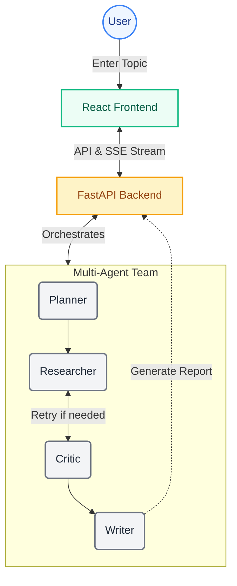

# Atlas: Multi-Agent AI Research Report Generator

Atlas is an AI-powered research assistant structured as a multi-agent team using **LangGraph**, **FastAPI**, and **React** (Vite + TypeScript + Tailwind CSS).

The team consists of four specialized agents working in a structured pipeline:
1. **Planner Agent**: Decomposes the research topic into 4–5 specific subtasks/threads.
2. **Researcher Agent**: Searches the web for each subtask using Tavily, gathering high-quality sources.
3. **Critic Agent**: Evaluates the research coverage. If there are gaps, it triggers a retry loop to gather more info.
4. **Writer Agent**: Synthesizes all gathered information into a structured, cited markdown report.

---

## 📐 Architecture & Flow

The following diagram illustrates the interactive flow and architecture between the React Frontend, FastAPI Backend, and the LangGraph Multi-Agent execution pipeline:



---

## 🛠️ Prerequisites

Before running the application, ensure you have:
- **Node.js** (v18 or higher)
- **Python** (3.11 or higher)
- A **Groq** API Key (for LLM inference)
- A **Tavily** API Key (for web search)
- (Optional) **Langfuse** API Keys (for agent trace logging)

---

## ⚙️ Environment Configuration

Create a `.env` file in the root directory:

```env
# Required — LLM inference via Groq
GROQ_API_KEY=your_groq_api_key_here

# Required — Web search
TAVILY_API_KEY=your_tavily_api_key_here

# Optional — Langfuse traceability (set all three to enable)
LANGFUSE_PUBLIC_KEY=your_langfuse_public_key_here
LANGFUSE_SECRET_KEY=your_langfuse_secret_key_here
LANGFUSE_HOST=https://cloud.langfuse.com
```

---

## 🚀 How to Run the App

Choose one of the following methods to run the application:

### Option 1: Development Mode (Vite Dev Server + FastAPI)
This is the recommended setup for development. It provides hot-reloading for both the frontend and backend.

1. **Activate the Virtual Environment & Start Backend:**
   ```bash
   # From the project root (ai-research-agent)
   source ../.venv/bin/activate
   pip install -r requirements.txt  # If not installed already
   python server.py
   ```
   *The FastAPI server will start on [http://localhost:7860](http://localhost:7860).*

2. **Start the Frontend Dev Server:**
   Open a **new terminal tab** and run:
   ```bash
   cd frontend
   npm install      # If not installed already
   npm run dev
   ```
   *The Vite dev server will start on [http://localhost:5173](http://localhost:5173).*
   *API calls are automatically proxied to the FastAPI server.*

---

### Option 2: Production Mode (FastAPI serving Built Frontend)
This mode builds the React app into static files and serves them directly via FastAPI on a single port.

1. **Build the Frontend Assets:**
   ```bash
   cd frontend
   npm run build
   ```

2. **Start the Unified Server:**
   ```bash
   cd ..
   source ../.venv/bin/activate
   python server.py
   ```
   *Access the full app at [http://localhost:7860](http://localhost:7860).*

---

### Option 3: Running via Docker
To run inside a container (simulating a Hugging Face Space deployment):

1. **Build the Docker Image:**
   ```bash
   docker build -t ai-research-agent .
   ```

2. **Run the Container:**
   ```bash
   docker run -p 7860:7860 --env-file .env ai-research-agent
   ```
   *Access the app at [http://localhost:7860](http://localhost:7860).*

---

## 📦 Deployment to Hugging Face Spaces

This application is fully containerized and pre-configured for **Hugging Face Spaces (Docker SDK)**.

1. Create a new Space on Hugging Face and choose **Docker** as the SDK.
2. Select the **Blank** template or configure the Space port to **7860**.
3. Push this repository's files to your Space's Git repository.
4. Add your secrets (`GROQ_API_KEY`, `TAVILY_API_KEY`, etc.) under the **Settings -> Variables and Secrets** tab in your HF Space.
5. Hugging Face will automatically build the multi-stage Dockerfile and host the application!
